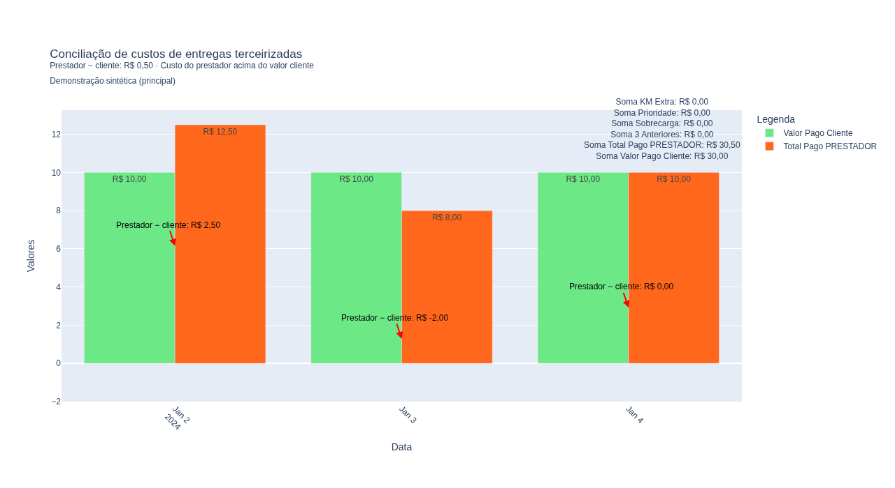

# Conciliação de custos de entregas terceirizadas

Notebook Python para conciliar exportações CSV de uma **plataforma de delivery** e de um **prestador de entregas sob demanda**, relacionando pedidos e comparando o custo do prestador com o campo de valor cliente. Processa **arquivos locais** com pandas e apresenta tabelas e gráfico Plotly; não consulta APIs nem exige credenciais das fontes.

O trabalho original foi registrado em **12 de janeiro de 2024**. Esta revisão acrescenta validações, contagens e uma demonstração inteiramente sintética. Os CSVs históricos da raiz têm somente cabeçalhos; seus resultados antigos **não foram reproduzidos**. As saídas salvas em `analise.ipynb` agora pertencem ao exemplo fictício, não a operações reais.



## Instalar e executar

Ambiente conferido: **Python 3.10.12**, pandas 2.2.3, Plotly 5.17.0, JupyterLab 4.3.4, ipykernel 6.29.5 e nbformat 5.10.4. Use Python 3.10 e os pacotes de `requirements.txt`; não precisa de banco, serviço externo ou dados operacionais.

Na raiz do checkout, em Bash/Linux:

```bash
python3 -m venv .venv
source .venv/bin/activate
python -m pip install -r requirements.txt
python -m pip check
python -m ipykernel install --sys-prefix \
  --name analise-terceirizacao \
  --display-name "Python (analise-terceirizacao)"
jupyter lab --no-browser --ip=127.0.0.1
```

Abra no navegador a URL local apresentada pelo Jupyter. No explorador de arquivos, abra `analise.ipynb`. Confirme **Python (analise-terceirizacao)** como kernel; se necessário, use **Kernel → Change Kernel** para selecioná-lo. Use **Run → Run All Cells** para executar a configuração e as quatro etapas em ordem.

A configuração começa com `CENARIO = "principal"`. Para a outra demonstração, troque por `"duplicidades"`, reinicie o kernel e execute todas as células novamente. Depois de mudar entradas ou após uma falha, execute desde a configuração. Encerre o servidor com `Ctrl+C` no terminal.

Os comandos acima usam Bash; em outros sistemas, adapte somente a ativação do ambiente virtual. O kernel é instalado dentro de `.venv` com `--sys-prefix`, sem alterar configurações remotas.

## Fluxo e convenção dos valores

1. Lê o extrato após cinco linhas de preâmbulo. Mantém exatamente `TYPE = ORDER` e `ORDER STATUS = COMPLETED`, sem normalizar caixa ou espaços.
2. Extrai a **primeira sequência de dígitos após `#`** em `ORDER REMARK`. Os pedidos sem identificador extraído são excluídos da correspondência, com contagem.
3. Lê a segunda fonte, exclui linhas com `TELEFONE` ausente e descarta `NOME`/`TELEFONE`. Preserva esse filtro histórico, sem validar formato de telefone; espaço isolado ainda é considerado presente.
4. Valida identificadores inteiros antes de convertê-los. Relaciona `ID PEDIDO` com `PEDIDO` por junção **inner**: os não pareados ficam fora do resultado, mas suas contagens são apresentadas de cada lado.
5. Converte `CREDITS (+/-)` em `TOTAL PAGO PRESTADOR` multiplicando por **−1**, sem valor absoluto. Calcula **diferença = prestador − cliente**, exportada em `DIFERENÇA PRESTADOR - CLIENTE`. Positivo significa custo acima desse campo cliente; negativo abaixo; zero igualdade. Não representa lucro/prejuízo ou custo total do negócio.
6. Exporta CSV e soma os valores por `DATA` para o gráfico, destacando até três maiores diferenças assinadas. Mostra também somas de km extra, prioridade e sobrecarga. Não recompõe o total pela soma das tarifas nem calcula custo/km.

Não há deduplicação nem escolha de um pareamento preferido. O notebook mostra contagens das entradas, exclusões dos filtros, registros sem identificador, chaves repetidas, linhas nessas chaves, não pareados, linhas resultantes e IDs distintos. Chave repetida é um ID presente em mais de uma linha; duas linhas com o mesmo ID contam como uma chave repetida e duas linhas nessa chave. Os avisos indicam quando essas chaves participam da junção e podem multiplicar somas.

## Dicionário das entradas

Ambas usam **vírgula como separador**, **ponto decimal**, **UTF-8** e aspas CSV padrão. Não há conversão de valores com vírgula decimal, `R$` ou agrupadores de milhares. Identificadores e valores financeiros nas linhas usadas devem ser numéricos e finitos; identificadores fracionários são rejeitados. Ausentes/incompatíveis interrompem a análise com campo e posição da linha de dados, sem preencher valores arbitrariamente.

Os cabeçalhos das entradas mantêm o esquema original, que não contém nomes de empresas. `ID PEDIDO` e `TOTAL PAGO PRESTADOR` são nomes genéricos das **colunas derivadas** da análise e das referências sintéticas desta revisão; não são novos campos exigidos nos CSVs de entrada.

### Extrato do prestador: `extrato-rede_parceira.csv`

Cinco linhas de preâmbulo, **cabeçalho na sexta linha**, depois registros. O código pula os metadados; o intervalo declarado no preâmbulo não cria filtro temporal. São exigidas as **44 colunas do esquema original**, inclusive as descartadas.

| Campo usado | Papel |
|---|---|
| `TYPE` | Filtro exato `ORDER` |
| `ORDER STATUS` | Filtro exato `COMPLETED` |
| `ORDER REMARK` | Primeiro marcador `#` seguido de dígitos |
| `DISTANCE (KM)` | Preservado no resultado; não usado no cálculo financeiro |
| `CREDITS (+/-)` | Créditos multiplicados por −1 para o total do prestador |
| `DELIVERY FEE` | `TAXA DE ENTREGA` |
| `STARTING PRICE` | `PREÇO INICIAL` |
| `EXTRA MILEAGE PRICE` | `PREÇO KM EXTRA` |
| `PRIORITY FEE` | `TAXA DE PRIORIDADE` |
| `SURCHARGE FEE` | `TAXA DE SOBRECARGA` |

Os seis campos financeiros devem estar preenchidos nas linhas que passam pelos filtros. Outros campos descartados podem ter valores vazios, mas suas colunas devem existir. Além dos oito campos retidos/transformados — observação, distância e seis financeiros —, estas 36 colunas são exigidas para o descarte original; `TYPE` e `ORDER STATUS` estão nesta lista:

```text
TYPE, ACTION, ORDER ID, ORDER STATUS
E-PAYMENT (+/-), CASH (+/-), STATEMENT TRANSACTIONS, FINAL AMOUNT
USER, USER ID, PICKUP DATE, CREATED
COMPLETED TIME, ORDER CITY, ADDRESSES, NUMBER OF STOPS
SPECIAL REQUEST ITEM, ORDER CONTACT, DRIVER ID, SPECIAL REQUEST
LARGE PACKAGE FEE, PREMIUM FEE, COUPON AMOUNT, SURCHARGE DISCOUNT
SAVER DISCOUNT, CS SUBSIDY, ADD ON FEE, MULTISTOP SURCHARGE
VEHICLE SPECIFICATION, CS ADJUSTMENT, REFUND, CANCELLATION FEE
CANCELLATION FEE REFUND, SERVICE TYPE, ORDER PATH, REFUND DATE
```

### Pedidos da plataforma: `terceirizados.csv`

Cabeçalho na primeira linha, sem preâmbulo:

| Campo obrigatório | Papel/formato |
|---|---|
| `DATA` | Texto não ausente nem composto apenas de espaços; agrupamento diário |
| `PEDIDO` | Identificador numérico inteiro para correspondência |
| `NOME` | Descartado; coluna ainda obrigatória |
| `TELEFONE` | Presença determina o filtro histórico; descartado após filtrar |
| `VALOR PAGO CLIENTE` | Valor numérico com ponto decimal |

Após o filtro de telefone, ausência de `DATA`, `PEDIDO` ou valor cliente interrompe a análise. Não há preenchimento por zero. Textos interpretados como ausentes pelo parser CSV também participam desses tratamentos.

Nos exemplos principais, `DATA` usa **`YYYY-MM-DD` com zeros**, permitindo que a ordenação textual seja cronológica. A revisão **não converte nem restringe datas históricas**: outros textos não vazios continuam sendo agrupados e ordenados lexicograficamente. Datas ausentes são rejeitadas para evitar que valores desapareçam do gráfico.

## Demonstrações e resultados esperados

### Principal — IDs únicos

[Extrato sintético](examples/principal/extrato-rede_parceira.csv), [pedidos sintéticos](examples/principal/terceirizados.csv), [resultado esperado](examples/principal/resultado-esperado.csv).

| Data | ID | Prestador | Cliente | Diferença |
|---|---:|---:|---:|---:|
| 2024-01-02 | 1001 | R$ 12,50 | R$ 10,00 | +R$ 2,50 |
| 2024-01-03 | 1002 | R$ 8,00 | R$ 10,00 | −R$ 2,00 |
| 2024-01-04 | 1003 | R$ 10,00 | R$ 10,00 | R$ 0,00 |
| **Total** | **3 IDs** | **R$ 30,50** | **R$ 30,00** | **+R$ 0,50** |

Três entradas em cada fonte, três pareamentos, nenhum filtro/exclusão, nenhuma chave repetida ou não pareada. Todas as pessoas, telefones, pedidos e valores são fictícios.

### Duplicidades e não pareados — demonstração de comportamento

[Extrato sintético](examples/duplicidades/extrato-rede_parceira.csv), [pedidos sintéticos](examples/duplicidades/terceirizados.csv), [resultado esperado](examples/duplicidades/resultado-esperado.csv).

Preserva o cenário do diagnóstico: **8 linhas do prestador e 5 da plataforma**. Exclui uma por `TYPE`, uma por status, uma sem identificador e uma por telefone ausente. Restam cinco e quatro linhas aptas; duas à esquerda e uma à direita não têm par. Há uma chave repetida em cada fonte, com duas linhas em cada uma. O ID `1002` gera **2 × 2 = 4 linhas**; `1001`, uma.

Referência: **5 linhas, 2 IDs distintos, custo R$ 52,50, valor cliente R$ 38,00 e diferença +R$ 14,50**. Essas somas incluem a multiplicação de correspondências: **não são um resultado financeiro operacional**. Nenhuma deduplicação foi aplicada. Os textos de data deste cenário preservam a ordenação lexicográfica observada no diagnóstico.

## Caminhos, arquivos gerados e proteção contra resultados antigos

Execute da raiz do checkout: caminhos são relativos ao diretório corrente. A configuração usa `examples/<cenario>/` para entrada e `outputs/<cenario>/` para saída. Para conferir apenas os cabeçalhos da raiz, defina `PASTA_ENTRADAS = Path(".")` e `PASTA_SAIDAS = Path("outputs/cabecalhos")`, atualizando `SAIDA_CSV` na configuração; não há registros históricos para analisar.

- `outputs/<cenario>/resultado.csv`: sobrescrito **após processamento válido**, sem índice, UTF-8/vírgula. Tem 11 colunas e a diferença formatada como texto `R$ ...` com vírgula decimal; os demais valores financeiros permanecem numéricos.
- `outputs/<cenario>/graficos/comparacao.html`: gráfico local com Plotly embutido, sem CDN ou interpretação matemática dos símbolos `R$`. O notebook exibe esse arquivo em um iframe no Jupyter; cada execução válida com correspondências sobrescreve o HTML.
- `examples/.../resultado-esperado.csv`: referência versionada, não sobrescrita pelo notebook.

Entradas vazias ou sem correspondências geram somente cabeçalho e mensagem; não tentam criar gráfico. Uma falha invalida o estado da execução, mesmo que haja CSV anterior no disco. A etapa do gráfico exige processamento concluído nesta sequência e verifica o hash do CSV; execução fora de ordem, remoção ou alteração do resultado bloqueiam sua apresentação. Depois de trocar arquivos, reinicie a execução desde a configuração.

## Precisão e decisões pendentes

Preservam-se a fórmula, os floats e `round(x, 2)` originais. A diferença por pedido vira texto no CSV; somas e diferenças diárias são recalculadas com os valores numéricos sem arredondamento prévio. Não há Decimal, política de centavos ou conversão de moeda. Por exemplo, `2.675` pode aparecer como `R$ 2,67`; somar diferenças arredondadas pode divergir de arredondar a soma. A classificação acima/abaixo/igual usa a diferença antes da formatação.

Permanecem pendentes: granularidade e tratamento das duplicidades; múltiplos marcadores `#`; significado de zeros à esquerda; finalidade do filtro de telefone; créditos positivos, ajustes e reembolsos; significado de valor cliente; critério de datas/período; precisão/arredondamento e política futura para dados ausentes. Esta revisão rejeita dados incompatíveis em vez de escolher conversões ou preenchimentos sem essa definição.

## Verificar localmente

Com `.venv` ativado:

```bash
python -m pip check
python -m unittest discover -s tests -v
```

Os testes executam as células reais com arquivos em pastas temporárias. Conferem as referências sintéticas, contagens, duplicidades, filtros, sinais, vazio, ausência de pares, campos inválidos, precisão original e bloqueio de resultado antigo. A execução integral e o roteiro no Jupyter também foram conferidos nesta revisão. Nenhum serviço das fontes é chamado.
